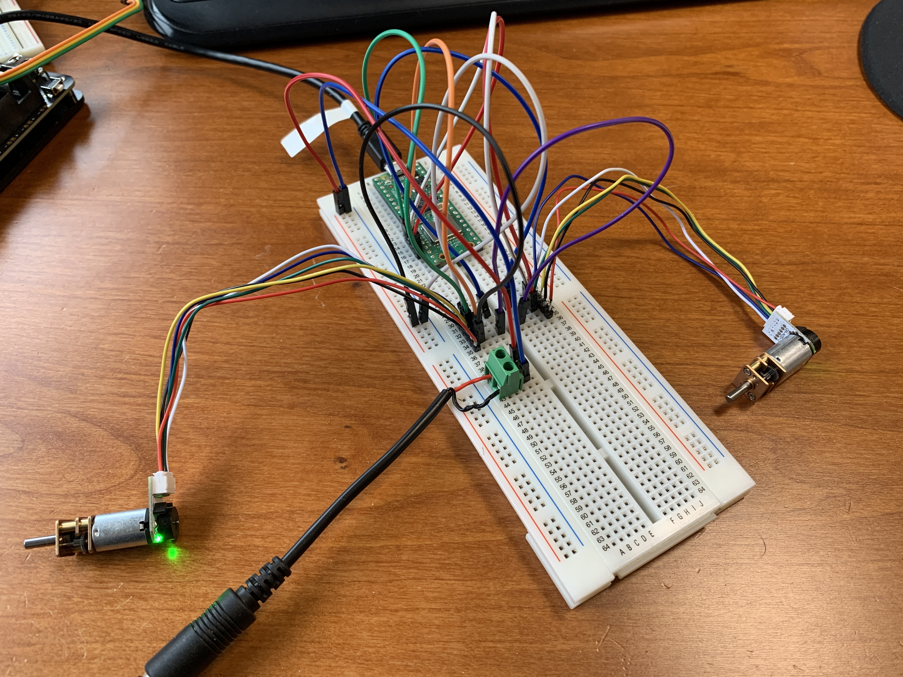
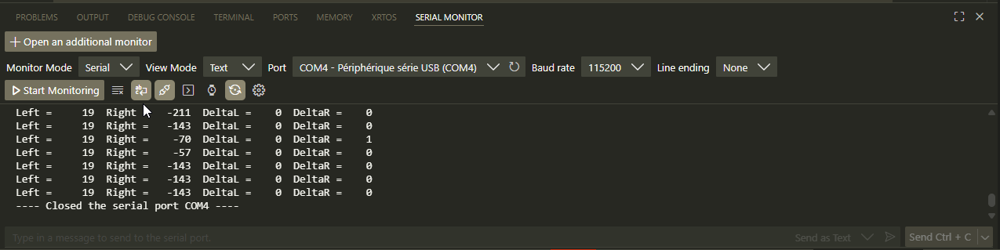

# Read encoder position of two motors

## Introduction

### Objectives

The goal of this program is to:

- learn how to use software times to avoid blocking function such as `sleep_ms()` as used in [03_pio_quadrature_encoder](https://gitlab.com/icam-mechatronics/pico2w/03_pio_quadrature_encoder)

### General Operation

When rotating the motor, the encoder value will update. This position is displayed periodically on the serial monitor.

> [!WARNING]  
> Be careful, the motor does not rotate automatically, you need to turn it by hand. Be careful, do not rotate too fast, the gearbox is fragile.

## Project Organization

The project consists of two files:

- `main.c`
- `quadrature_encoder.pio`

### Details of the file `quadrature_encoder.pio`

see example [03_pio_quadrature_encoder](https://gitlab.com/icam-mechatronics/pico2w/03_pio_quadrature_encoder)

### Main functions of the file `main.c`

```c
// Base pin for the A phase of the left encoder. The B phase must be connected to the next pin.
const uint PIN_AB_LEFT = 10;
// Base pin for the B phase of the right encoder. The B phase must be connected to the next pin.
const uint PIN_AB_RIGHT = 12;
```

### Details of the file `CmakeLists.txt`

No modifications in the `CmakeLists.txt` file.

## Technical Explanations

### Hardware configuration

- a Pico board 2W
- a [motor driver](https://wiki.dfrobot.com/Dual_1.5A_Motor_Driver_-_HR8833_SKU__DRI0040?gad_source=1&gad_campaignid=22392107167&gbraid=0AAAAADucPlB2QfPl8jKoN43RmIXhq9TOr&gclid=CjwKCAiA55rJBhByEiwAFkY1QHyQRlnwZyrh2YmPLSB3JS2XEZR6v5OoZ1U0eSHypaFj3XcMRbHmexoC1hgQAvD_BwE)
- two [cc motors with encoder](https://www.dfrobot.com/product-1433.html)



- [ ] connect A and B signals to GPIO10 and GPIO11 for left motor
- [ ] connect A and B signals to GPIO12 and GPIO13 for right motor

### Design Choices

## Usage Instructions

### How to Compile and Run

- [ ] compile with Pico extension in vscode
- [ ] run with Pico extension in vscode

- [ ] open the Serial Monitor
- [ ] Click on Start Monitoring


- [ ] move motor manually, you should see the position of the encoder being updated on the serial monitor


## Tests and Validation

### Version and Test results

This code has been validated the 08/12/2025 with version "Initial version".

## Future Work

- [ ] use this information to obtain the position of the robot in the horizontal plane
